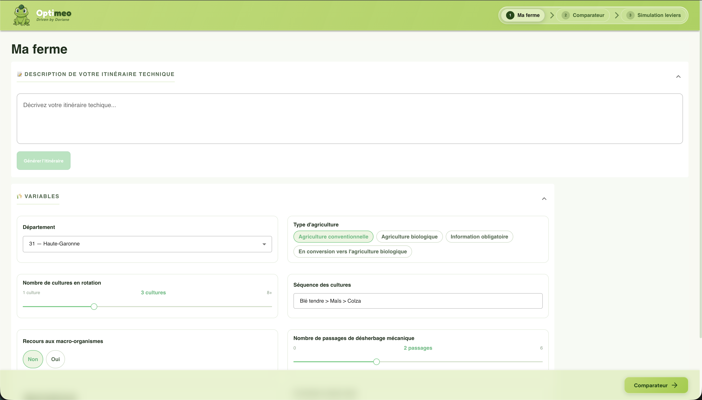

# GAIA - Optimisation des pratiques agricoles



Outil d'aide à la decision pour les agriculteurs : diagnostic de l'Indice de Fréquence de Traitement (IFT), comparaison aux pratiques du territoire et simulation de leviers agronomiques.

## Structure du projet

```
gaia-hackathon/
├── monorepo/              # Application web (frontend + backend)
│   ├── back/api/          # API NestJS (port 3001)
│   ├── front/web/         # Frontend React + Vite (port 3000)
│   ├── libs/shared-type/  # Types TypeScript partages
│   └── docker-compose.yml # PostgreSQL 17
│
└── DephyPGDataset/        # Pipeline de donnees Dephy
    ├── src/schema/        # Schema Drizzle ORM
    ├── scripts/           # Scripts d'import CSV
    ├── machine_learning/  # Modeles ML
    └── docker-compose.yml # PostgreSQL (port 5433)
```

## Stack technique

| Couche | Technologies |
|--------|-------------|
| **Frontend** | React, Vite, MUI, React Router, Jotai, Axios |
| **Backend** | NestJS, node-postgres, PostgreSQL 17 |
| **Donnees** | Drizzle ORM, PostgreSQL, CSV import |
| **ML** | Python (machine_learning/) |
| **Monorepo** | Yarn 4 workspaces |

## Demarrage rapide

### Application web (monorepo/)

```bash
cd monorepo
yarn install

# Configuration
cp back/api/env/.env.example back/api/env/.env
cp front/web/.env.example front/web/.env

# Base de donnees
yarn db:up
yarn build
yarn db:init

# Lancement
yarn api:dev   # API sur http://localhost:3001/api
yarn web:dev   # Frontend sur http://localhost:3000
```

### Pipeline de donnees (DephyPGDataset/)

```bash
cd DephyPGDataset
yarn install
yarn db:start        # PostgreSQL sur port 5433
yarn drizzle:migrate # Appliquer les migrations
yarn import:data     # Importer les donnees CSV
```

## Fonctionnalites

- **Ma ferme** — Saisie de l'itineraire technique (variables agronomiques, departement, type d'agriculture)
- **Comparateur** — Benchmark des pratiques par rapport aux exploitations du territoire (frequences, medianes)
- **Simulation des leviers** — Recalcul de l'IFT en temps reel selon les pratiques alternatives

## Liens utiles

- **Swagger API** : http://localhost:3001/api/doc
- **Drizzle Studio** : `cd DephyPGDataset && yarn drizzle:studio`
